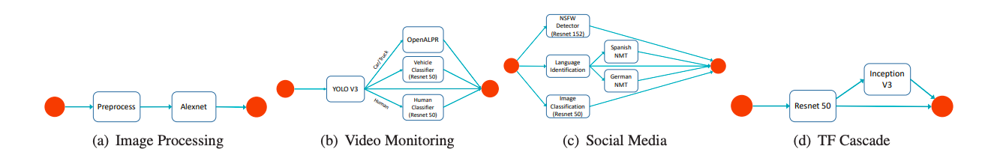
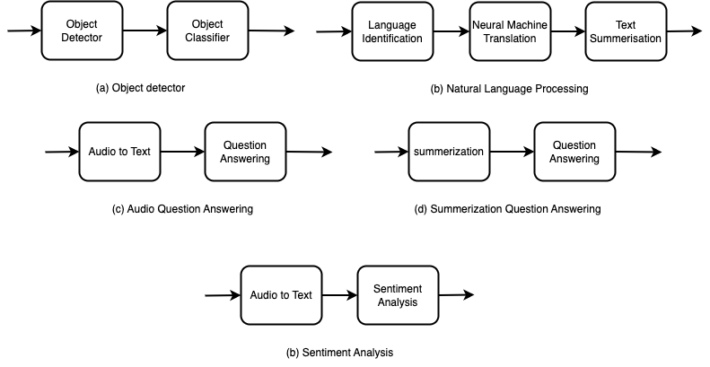

# Description

This repo contains a set of practice inference graphs implemented using [Seldon core inference graph](https://docs.seldon.io/projects/seldon-core/en/latest/graph/inference-graph.html). Inference graphs in [seldon](./seldon/) folder are implemented using [Seldon 1st gen custom python package](https://docs.seldon.io/projects/seldon-core/en/latest/python/python_wrapping_docker.html) and pipelines in [mlserver](./mlserver/) folder are implemented using [Serving Custom Model](https://mlserver.readthedocs.io/en/latest/examples/custom/README.html) Seldon's newer serving platform [mlserver](https://mlserver.readthedocs.io/en/latest/examples/custom/README.html) and Seldon Inference Graph.

NOTE: This repo is shared for learning purposes, some of the pipeliens implemented here might not have a real-world usecases and they are not fully tested.

Pull requests, suggestions and completing the list of pipelines for future implementation are highly appreciated.

## Inference graphs implemented using 1st gen Seldon
Pipelines from [InferLine: latency-aware provisioning and scaling for prediction serving pipelines](https://dl.acm.org/doi/10.1145/3419111.3421285)
1. Cascade
2. Ensemble
3. Preprocess
4. Vidoe Monitoring

and the following pipelines:

5. audio-qa: Audio to text -> Question Answering
6. audio-sent: Audio to text -> Sentiment Analysis
7. nlp: language identification -> translate fr to Eng -> summerisation
8. sum-qa: Summerisation -> Question Answering
9. video: Object Detection -> Object Classification

## Inference graphs implemented using MLServer

1. audio-qa: Audio to text -> Question Answering
2. audio-sent: Audio to text -> Sentiment Analysis
3. nlp: language identification -> translate fr to Eng -> summerisation
4. sum-qa: Summerisation -> Question Answering
5. video: Object Detection -> Object Classification

## DockerHub
Pre-built container images are also available [here](https://hub.docker.com/u/sdghafouri). Therefore if you are just trying out, you can deploy yaml files on your K8S cluster the way they are.

## Sources of Pipelines for Future Implementation

### Academic Papers
1. [InferLine: latency-aware provisioning and scaling for prediction serving pipelines](https://dl.acm.org/doi/10.1145/3419111.3421285)
2. [GrandSLAm: Guaranteeing SLAs for Jobs in
Microservices Execution Frameworks](https://jeongseob.github.io/papers/kannan_eurosys19.pdf)
3. [FA2: Fast, Accurate Autoscaling for Serving Deep Learning Inference with SLA Guarantees](https://ieeexplore.ieee.org/document/9804606)
4. [Rim: Offloading Inference to the Edge](https://dl.acm.org/doi/pdf/10.1145/3450268.3453521)
5. [Llama: A Heterogeneous & Serverless Framework for
Auto-Tuning Video Analytics Pipelines](https://web.stanford.edu/~faromero/llama.pdf)
6. [Scrooge: A Cost-Effective Deep Learning Inference System](https://dl.acm.org/doi/10.1145/3472883.3486993)
7. [Nexus: A GPU Cluster Engine for Accelerating DNN-Based Video Analysis](https://homes.cs.washington.edu/~arvind/papers/nexus.pdf)
8. [VideoEdge: Processing Camera Streams using Hierarchical Clusters](https://ieeexplore.ieee.org/document/8567661)
9. [Live Video Analytics at Scale with Approximation and Delay-Tolerance](https://www.usenix.org/conference/nsdi17/technical-sessions/presentation/zhang)
10. [Serving Heterogeneous Machine Learning Models on Multi-GPU Servers with Spatio-Temporal Sharing](https://www.usenix.org/conference/atc22/presentation/choi-seungbeom)

### Industrial Projects
1. [Clarifai Workflows](https://clarifai.com/clarifai/main/workflows)
2. [Facebook DLRM](https://github.com/facebookresearch/dlrm)

## Load Tester
This repo also includes a small async load tester for sending workloads to the models/pipeliens. 
You can find it under [async load tester](./async_load_tester) folder.

## Sources of Models

### Audio and Text Models

Source:
1. [HuggingFace](https://huggingface.co/)

### For Image Models

Source:
1. [Timm](https://github.com/rwightman/pytorch-image-models)
2. [TorchVision](https://github.com/pytorch/vision)

Please give a star if this repo helped you learning somthing new :)

### TODOs
<<<<<<< HEAD
1. Send data in compresss way
2. Add performance evaluation scripts and load tester
3. Complete Unfinished pipelines
4. Examples of using [Triton Client](https://github.com/triton-inference-server/client/tree/main/src/python/examples) for interacting with MLSserver examples
5. Examples of using [Triton Inference Server](https://github.com/triton-inference-server/server) as the serving backend
6. Pipelines implementation in upcoming Seldon core V2
=======
1. Examples of Grpc data transfer
2. Send data in compresss way
3. Add performance evaluation scripts and load tester
4. Complete Unfinished pipelines
5. Example of using [Triton Client](https://github.com/triton-inference-server/client/tree/main/src/python/examples) for interacting with MLSserver examples
6. GPU examples
7. Examples of Integration with Autoscalers ([Builtin Autoscaler](https://kubernetes.io/docs/tasks/run-application/horizontal-pod-autoscale/), [VPA](https://github.com/kubernetes/autoscaler/tree/master/vertical-pod-autoscaler) and event-driven autoscaler like [KEDA](https://keda.sh/))
>>>>>>> b4f5d8f9573854943b0c70563d4721b5313dbd2e
