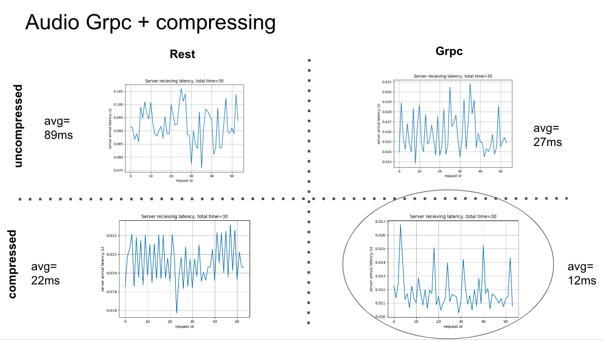
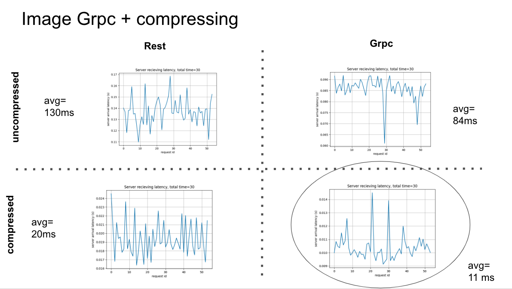
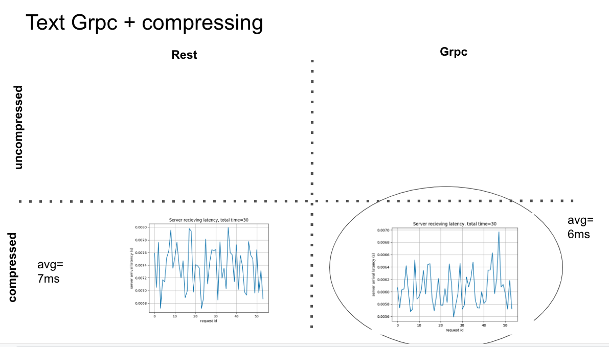

# Latency Benchmarks

Results of load testing benchmark of different ways of sending files
To run benchmarks run the load tester in the parent directory

Note: The benchmarks are run in the seldon+mlserver mode not local mlserver

1. [audio-compressed](audio-compressed)
    1. [rest](audio-compressed/rest/): sending audio as base64 arrray
    2. [grpc](audio-compressed/grpc/): sending audio as bytes arrray
2. [audio-uncompressed](audio-uncompressed): sending audio files using seldon/mlserver builtin way for sending in both grpc and rest
3. [image-compressed](image-compressed)
    1. [rest](image-compressed/rest/): sending image as base64 arrray
    2. [grpc](image-compressed/grpc/): sending image as bytes arrray
4. [image-uncompressed](image-uncompressed): sending audio files using seldon/mlserver builtin way for sending in both grpc and rest
2. [text-compressed](text): sending text files using seldon/mlserver builtin way for sending in both grpc and rest

Here are the results of running benchmark for 30 seconds on 2 rps, the load tester is sending the first request at the start and the second one at the half of the second e.g. 0, 0.5, 1, ... are sending times of the request, the server is also a mock server with a sleep of 0.3 seconds. The circled combination is the best option in terms of latency.

To reproduce the results 1. install the [loadtester](../load_tester/) on your python env 2. Deploy the kubernetes yaml in each folder (e.g. [this](text/node.yaml)) and 3. run the relevant load test (e.g. [this](text/load-test-grpc.py))